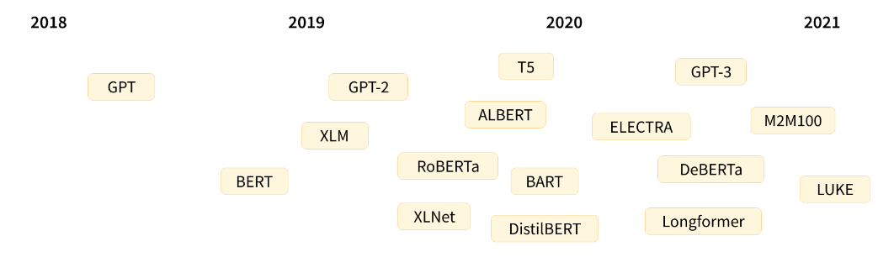
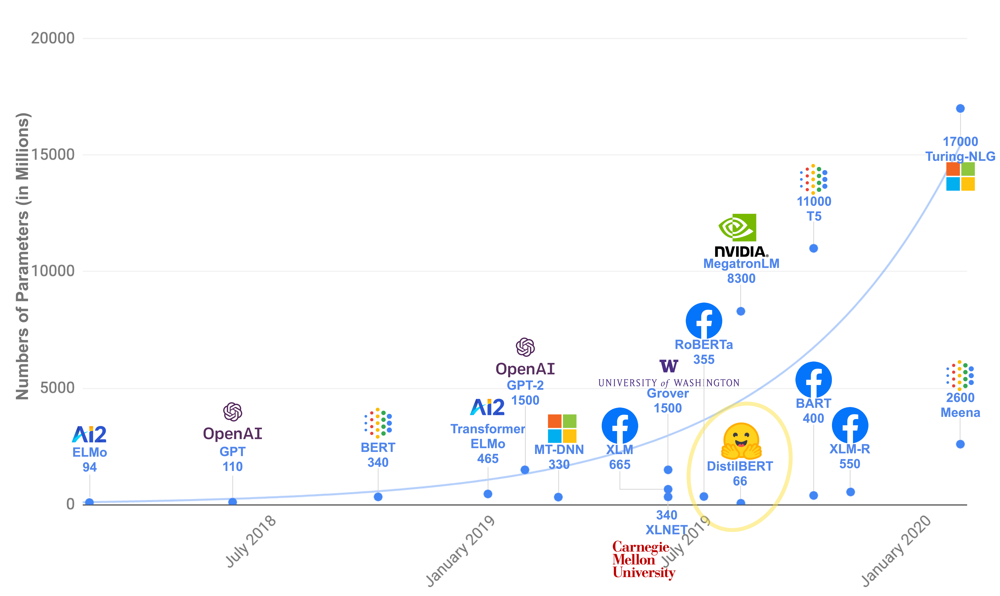
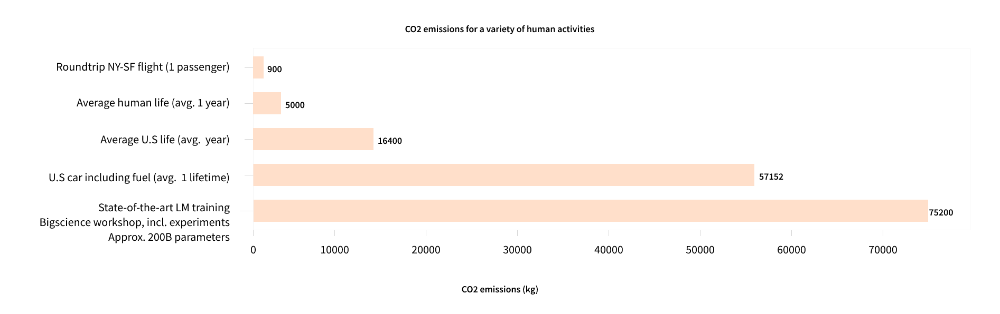

# TRANSFORMER MODELS

The transformer architecture was created with a focus on translation tasks.

- 2018-June: GPT was the 1st pre-trained model what was trained and released.
- 2018-October: BERT was designed to produce better summaries of sentences. 
- 2019-February - GPT 2
- 2019 - October: DistilBert a distilled version of BERT that is 60% faster, 40% lighter in memory, and still retains 97% of BERT’s performance
- 2019 - BART and T5 two large pretrained models using the same architecture as the original Transformer model (the first to do so)
- 2020 - GPT 3 - Bigger version of GPT 2 - no need for finetuning ( zero shot learning )

Transformer models can be broadly captured into 3 categories. 
- GPT-like (also called auto-regressive Transformer models)
- BERT-like (also called auto-encoding Transformer models)
- BART/T5-like (also called sequence-to-sequence Transformer models)

### TRANSFORMERS ARE LANGUAGE MODELS

- All the models mentioned above are language models. They have been trained on a large amounts of raw text in a self supervised way.
- self-supervised learning is a type of training in which the objective is automatically computed from the inputs of the model. That means that humans are not needed to label the data!
- This type of model develops a statistical understanding of the language it has been trained on, but it’s not very useful for specific practical tasks. Because of this, the general pretrained model then goes through a process called transfer learning. During this process, the model is fine-tuned in a supervised way — that is, using human-annotated labels — on a given task.

- Examples of fine-tuning tasks:
  - casual Language Modeling: predicting the next word in a sentence having read the n previous words. the output depends on the past and present inputs, but not the future ones.
  - masked language Modeling:  model predicts a masked word in the sentence

### TRANSFORMERS ARE BIG MODELS

- Apart from a few outliers (like DistilBERT), the general strategy to achieve better performance is by increasing the models’ sizes as well as the amount of data they are pretrained on.
    
- But training a large model also has consequences on the environment in terms of CO2 emissions.
  
- Hence we use transfer learning- which means the training is done on top of a pre-trained model. To perform fine-tuning, you first acquire a pretrained language model, then perform additional training with a dataset specific to your task
- For example, one could leverage a pretrained model trained on the English language and then fine-tune it on an arXiv corpus, resulting in a science/research-based model. The fine-tuning will only require a limited amount of data: the knowledge the pretrained model has acquired is “transferred,” hence the term transfer learning.