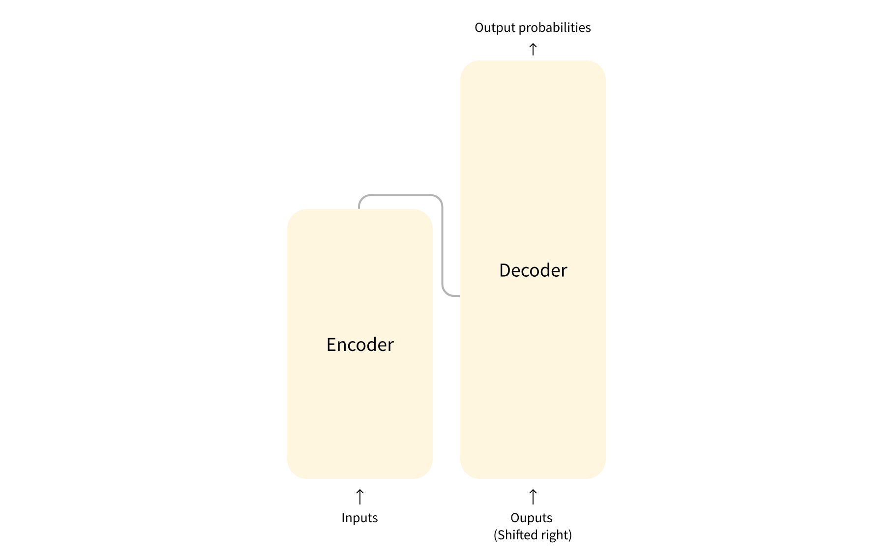

# TRANSFORMER GENERAL ARCHITECTURE

- Mainly 2 blocks : Encoder and Decoder
- **Encoder** - Receives an input and builds a representation of it (its features). This means that the model is optimized to acquire understanding from the input.
- **Decoder** - The decoder uses the encoder’s representation (features) along with other inputs to generate a target sequence. This means that the model is optimized for generating outputs.

- Encoder-only models: Good for tasks that require understanding of the input, such as sentence classification and named entity recognition.
- Decoder-only models: Good for generative tasks such as text generation.
- Encoder-decoder models or sequence-to-sequence models: Good for generative tasks that require an input, such as translation or summarization.

### ATTENTION LAYERS
- This layer will tell the model to pay specific attention to certain words in the sentence that has been passed ( and more or less ignore the others) when dealing with the representation of each word.
---

### The original architecture

- The Transformer architecture was originally designed for translation. During training, the encoder receives inputs (sentences) in a certain language, while the decoder receives the same sentences in the desired target language. In the encoder, the attention layers can use all the words in a sentence (since, as we just saw, the translation of a given word can be dependent on what is after as well as before it in the sentence). The decoder, however, works sequentially and can only pay attention to the words in the sentence that it has already translated (so, only the words before the word currently being generated). For example, when we have predicted the first three words of the translated target, we give them to the decoder which then uses all the inputs of the encoder to try to predict the fourth word.
- To speed things up during training (when the model has access to target sentences), the decoder is fed the whole target, but it is not allowed to use future words
- 
- Note that the first attention layer in a decoder block pays attention to all (past) inputs to the decoder, but the second attention layer uses the output of the encoder. It can thus access the whole input sentence to best predict the current word. This is very useful as different languages can have grammatical rules that put the words in different orders, or some context provided later in the sentence may be helpful to determine the best translation of a given word.
- The attention mask can also be used in the encoder/decoder to prevent the model from paying attention to some special words — for instance, the special padding word used to make all the inputs the same length when batching together sentences.

### ENCODER ONLY MODELS

- Encoder models use only the encoder of a Transformer model. At each stage, the attention layers can access all the words in the initial sentence. These models are often characterized as having “bi-directional” attention, and are often called auto-encoding models.
- The pretraining of these models usually revolves around somehow corrupting a given sentence (for instance, by masking random words in it) and tasking the model with finding or reconstructing the initial sentence.
- Encoder models are best suited for tasks requiring an understanding of the full sentence, such as sentence classification, named entity recognition (and more generally word classification), and extractive question answering.
- ALBERT , BERT , DistilBERT , ELECTRA , ROBERTa are some examples

### DECODER ONLY MODELS

- Decoder models use only the decoder of a Transformer model. At each stage, for a given word the attention layers can only access the words positioned before it in the sentence. These models are often called auto-regressive models.
- The pretraining of decoder models usually revolves around predicting the next word in the sentence.
- These models are best suited for tasks involving text generation.
- CTRL, GPT, GPT-2, Transformer XL are some examples

### Sequence to Sequence Models

- Encoder-decoder models (also called sequence-to-sequence models) use both parts of the Transformer architecture. At each stage, the attention layers of the encoder can access all the words in the initial sentence, whereas the attention layers of the decoder can only access the words positioned before a given word in the input.
- The pretraining of these models can be done using the objectives of encoder or decoder models, but usually involves something a bit more complex. For instance, T5 is pretrained by replacing random spans of text (that can contain several words) with a single mask special word, and the objective is then to predict the text that this mask word replaces.
- Sequence-to-sequence models are best suited for tasks revolving around generating new sentences depending on a given input, such as summarization, translation, or generative question answering.
- BART , mBART , Marian , T5 are some examples

